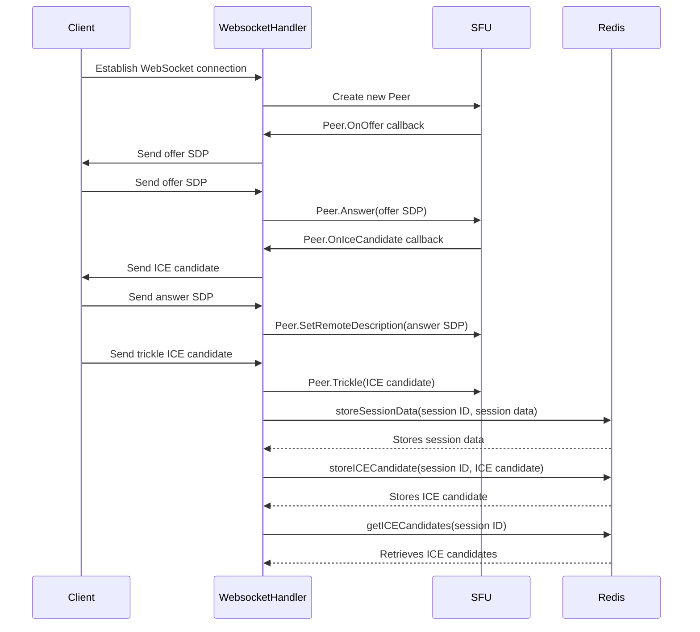

```mermaid
sequenceDiagram
participant Client
participant WebsocketHandler
participant SFU
participant Redis

    Client->>WebsocketHandler: Establish WebSocket connection
    WebsocketHandler->>SFU: Create new Peer
    SFU->>WebsocketHandler: Peer.OnOffer callback
    WebsocketHandler->>Client: Send offer SDP
    Client->>WebsocketHandler: Send offer SDP
    WebsocketHandler->>SFU: Peer.Answer(offer SDP)
    SFU->>WebsocketHandler: Peer.OnIceCandidate callback
    WebsocketHandler->>Client: Send ICE candidate
    Client->>WebsocketHandler: Send answer SDP
    WebsocketHandler->>SFU: Peer.SetRemoteDescription(answer SDP)
    Client->>WebsocketHandler: Send trickle ICE candidate
    WebsocketHandler->>SFU: Peer.Trickle(ICE candidate)
    WebsocketHandler->>Redis: storeSessionData(session ID, session data)
    Redis-->>WebsocketHandler: Stores session data
    WebsocketHandler->>Redis: storeICECandidate(session ID, ICE candidate)
    Redis-->>WebsocketHandler: Stores ICE candidate
    WebsocketHandler->>Redis: getICECandidates(session ID)
    Redis-->>WebsocketHandler: Retrieves ICE candidates

```